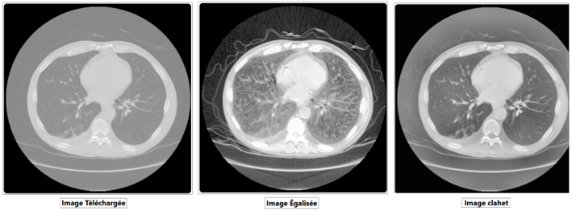
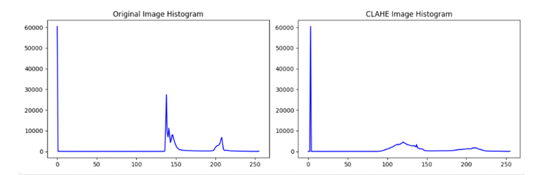
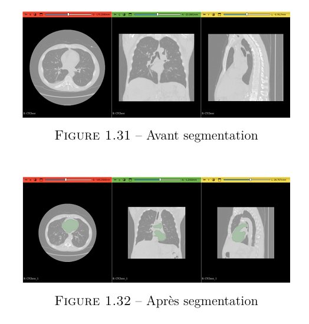
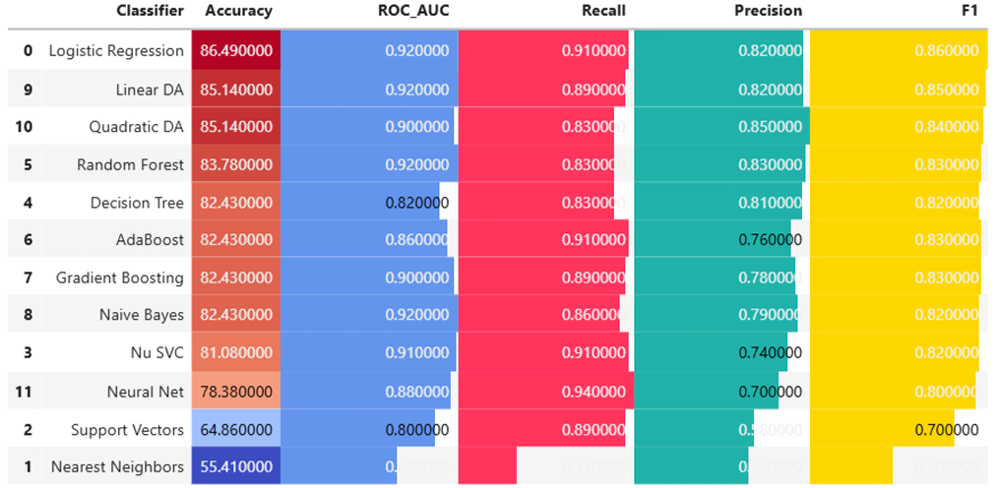
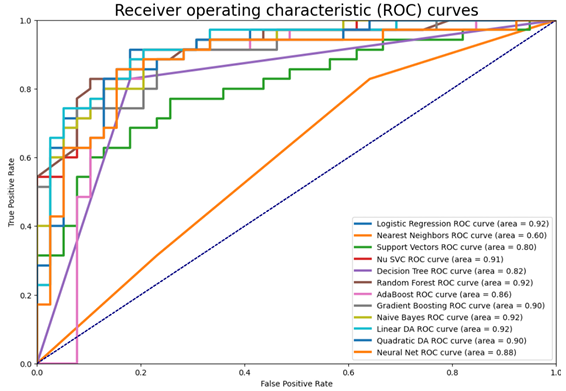

# 🩺 SmartMed: AI-Powered Cardiac Care Platform

## 🧭 Overview

**SmartMed** is a project developed at the **Higher School of Communications of Tunis (SUP’COM)** during the **2025–2026 academic year**. It combines **artificial intelligence (AI)**, the **Internet of Things (IoT)**, and **web technologies** to offer an advanced platform for aiding in the diagnosis and prevention of cardiac diseases.

The system offers:

*   **Medical image enhancement** (CT),
*   **3D heart segmentation**,
*   **Heart attack risk prediction**,
*   **Real-time online medical consultations**.

---

## ⚙️ Technologies Used

### 🌐 Frontend

*   **HTML5**: Web content structure
*   **CSS3**: Styling for an ergonomic interface
*   **JavaScript**: Interactive features (image zoom, etc.)
*   **jQuery**: Simplifies DOM manipulation and event management

### 🖥️ Backend

*   **Django**: Python framework for server logic and data management

### 🧠 Machine Learning & AI

*   **TotalSegmentator**: 3D segmentation of cardiac structures
*   **Logistic Regression**: Heart attack risk prediction
*   **LoRA + Unsloth**: Fine-tuning LLMs
*   **Hugging Face**: Model hosting and sharing

### 📡 IoT

*   **Arduino**: Acquisition of vital signs (temperature, heart rate)
*   **ThingSpeak**: Real-time IoT data visualization
*   **ZEGOCLOUD API**: Live online medical consultations

### 🛠️ DevOps

*   **Jenkins**: Continuous Integration and Deployment (CI/CD)
*   **NGINX**: Reverse proxy & static file management
*   **Docker**: Service containerization
*   **Trivy**: Vulnerability scanning
*   **SonarQube**: Code quality analysis
*   **Prometheus & Grafana**: Performance monitoring

### 🔐 Security

*   **Nmap & Wireshark**: Network security testing

---

## 🏥 Key Features

### 📈 Medical Image Enhancement

We applied two main techniques to **enhance the quality of CT images**:

*   **Histogram Equalization**: improves overall **brightness and contrast**.
*   **CLAHE (Contrast Limited Adaptive Histogram Equalization)**: enhances **local contrast** while **preserving details** without creating artifacts.

> While the improvement is noticeable, it's not perfect. Artifacts may appear depending on the parameters, but overall readability is significantly improved.
<p align="center">
  
</p>
*   🖼️ **This Figure**: shows contrast improvement after histogram equalization.
<p align="center">
  
</p>
*   🖼️ **This Figure**: illustrates CLAHE transformation results with a better-distributed histogram in dark areas.

These methods offer a **good trade-off** between contrast enhancement and detail preservation.

---

### 🫀 Heart Segmentation

We used the **TotalSegmentator API** to perform **3D segmentation** of cardiac CT images. To **speed up processing**, we chose the **`fast` mode**, which slightly sacrifices precision for execution time.

> ✅ The results are satisfactory for visualizing and analyzing the **internal structures** of the heart, despite slightly lower **precision**.

The outputs are visualized with **3D Slicer**, facilitating the anatomical study of the heart.
<p align="center">
  
</p>
---

### ❤️‍🔥 Heart Attack Prediction

We tested several machine learning algorithms. The **logistic regression model** was selected for its **superior performance**.

*   📊 Results include: **confusion matrices** and **ROC curves**.
<div style="display: flex; justify-content: space-between; align-items: center;">
  
  
</div>
*   🎯 The model classifies patients according to their **heart attack risk** based on their clinical data.

---

### 🔴 Online Consultations via IoT

*   🩺 The patient's vital signs—such as body temperature and heart rate—are measured using an Arduino setup.
*   🧪 Before actual deployment, we simulated this system using Proteus, allowing us to test sensor behavior in a virtual environment.
*   🔌 Since Proteus cannot directly interact with a real serial port, we used HHD Virtual Serial Port Tools to create a virtual connection (COM port) between Proteus and our host machine.
*   🐍 A simple Python script was used to read data from the virtual COM port and automatically send them to ThingSpeak, where measurements are visualized in real-time via graphs.
*   📡 IoT data are then accessible via a web interface for continuous medical monitoring.
*   👨‍⚕️ Thanks to the ZEGOCLOUD API, doctors can initiate remote consultations while viewing the patient's live vital signs displayed on the platform.

---

### 🧠 LLM for CT Image Analysis

We fine-tuned a **Large Language Model (LLM)** with **LoRA** via **Unsloth** for semantic analysis of CT images.

*   📁 The model is hosted on **Hugging Face**.
*   💻 It is accessible via a **Google Colab notebook**.
*   ❗ Full deployment was not achieved due to the complexity of required resources.

---

### 🔁 CI/CD Pipeline
We implemented a fully automated DevOps pipeline to ensure continuous integration, secure deployments, and real-time monitoring for SmartMed.

*   **⚙️ Jenkins** :Automates testing, linting, and deployment with each code push.

*   **🧪 SonarQube + Trivy** :

    *   **SonarQube** :analyzes code quality, detects bugs, and ensures maintainability.

    *   **Trivy** :scans Docker containers for vulnerabilities.
      
*   **📦 Docker + NGINX**:
    *   **Docker** :containerizes the entire application for consistent environments.
    *   **NGINX** :serves static files (CSS, JS, images) and acts as a reverse proxy to forward client requests to the Django backend.
      
*   **📊 Prometheus + Grafana**:
    *   **Prometheus** :collects metrics from the app (CPU, memory, uptime).
    *   **Grafana** :visualizes these metrics through customizable dashboards.
---

### 🔒 Security Testing

We performed **network security tests** using:

*   **Nmap**: scanning for exposed ports and services.
*   **Wireshark**: analyzing network traffic to detect vulnerabilities.

---

## 📊 Results Visualization

| Result                             | Tool Used                     | Details                       |
| ---------------------------------- | ----------------------------- | ----------------------------- |
| **CT Image Enhancement**           | Web UI                        | CLAHE + equalization results  |
| **3D Heart Segmentation**          | 3D Slicer                     | Interactive display           |
| **Heart Attack Prediction**        | Django + Matplotlib           | ROC, confusion matrix         |
| **IoT Data (temperature, BPM)**    | ThingSpeak + Web dashboard    | Real-time graphs              |
| **LLM Analysis**                   | Google Colab + Hugging Face   | Textual summaries             |
| **Monitoring & Security**          | Grafana, Trivy, Jenkins, Nmap | Dashboards + reports          |

---

## 🧰 Setup Instructions

### ✅ Prerequisites

*   Python installed on your machine
*   Pip (Python package manager) installed
*   Docker and Docker Compose installed

### 🚀 Installation

Steps to Run the Site
Option 1: Using a Virtual Environment
1.  Create a Virtual Environment
    Open your terminal or command line and run the following command to create a virtual environment:
    ```sh
    python -m venv env
    ```
2.  Activate the Virtual Environment
    On Windows:
    ```sh
    env\Scripts\activate
    ```
    On macOS and Linux:
    ```sh
    source env/bin/activate
    ```
3.  Navigate to the Project Folder
    Change directory to the project folder:
    ```sh
    cd SmartMed
    ```
4.  Install Dependencies
    Install all dependencies listed in the `requirements.txt` file:
    ```sh
    pip install -r requirements.txt
    ```
5.  Run the Development Server
    To start the SmartMed website:
    ```sh
    python manage.py runserver
    ```
    The site should now be accessible at `http://127.0.0.1:8000/` in your web browser.

Option 2: Using Docker Compose
1.  Pull Docker Images
    ```sh
    docker pull marwenbellili/nginx:latest
    docker pull marwenbellili/smartmed:latest
    ```
2.  Create a `docker-compose.yml` File
    Add the following content to a `docker-compose.yml` file:
    ```yaml
    services:
      nginx:
        image: marwenbellili/nginx:latest # Using the pre-pulled image
        ports:
          - "80:80"
        volumes:
          - static_volume:/app/staticfiles
          - media_volume:/app/mediafiles
        depends_on:
          - smartmed
        restart: always
        deploy:
          resources:
            limits:
              memory: 4G        
            reservations:
              memory: 2G        

      smartmed:
        image: marwenbellili/smartmed:latest # Using the pre-pulled image
        command: sh -c "gunicorn SmartMed.wsgi:application --bind 0.0.0.0:8000"
        volumes:
          - static_volume:/app/staticfiles
          - media_volume:/app/mediafiles
        expose:
          - "8000"
        restart: always
        deploy:
          resources:
            limits:
              memory: 8G        
            reservations:
              memory: 4G        
        runtime: nvidia              
        environment:
          - NVIDIA_VISIBLE_DEVICES=all  

    volumes:
      static_volume:
      media_volume:
    ```
    *(Note: If you wish to build the images locally instead of pulling them, replace `image: ...` with `build: ./nginx` and `build: ./SmartMed` respectively, and ensure you have the Dockerfiles in those locations.)*

3.  Start the Containers
    Launch the services with Docker Compose:
    ```sh
    docker-compose up -d
    ```
    The SmartMed site should now be accessible on port 80 via your browser!

---

### 🤖 LLM Access

*   The **Colab notebook** is available for testing the fine-tuned model.[Try The Model](https://colab.research.google.com/drive/1AGGNVoC-DFCiVFZ3-GgFKxxLcATJxRM5?usp=sharing)
*   The model files on **Hugging Face**: [link to the repository](https://huggingface.co/Marwen72/lora_model).
